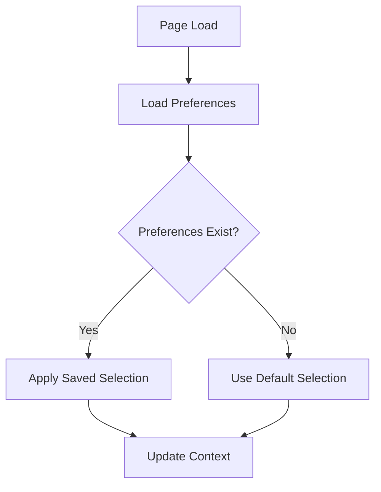
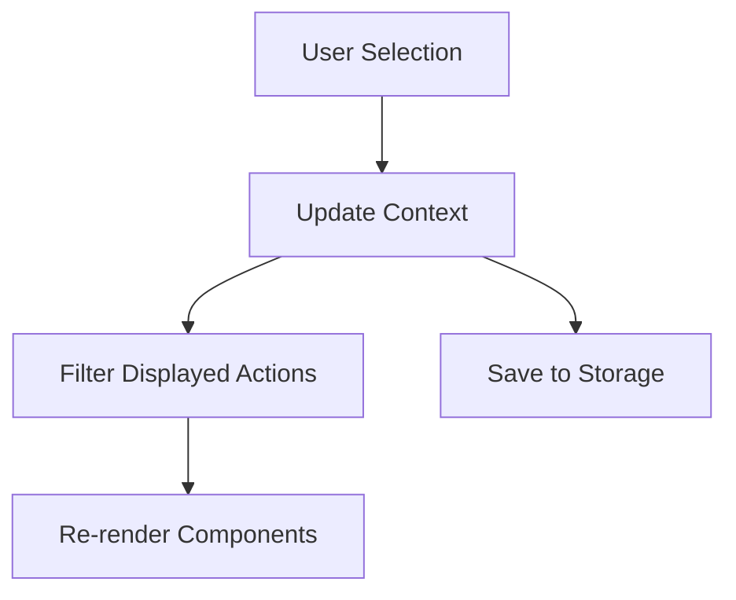

# Action Selector Technical Specification

## Component Changes Required

### 1. DashboardCampaigns/index.tsx
```typescript
interface DashboardCampaignsProps {
  brandId: number;
  since: string;
  until: string;
  // New props
  selectedActions?: string[];
  onActionSelectionChange?: (actions: string[]) => void;
}
```

### 2. CampaignActions Component
```typescript
interface CampaignActionsProps {
  actions: FacebookAction[];
  costPerAction: FacebookAction[];
  // New props
  selectedActionTypes?: string[];
  showAllActions?: boolean;
}
```

## New Components

### 1. Action Selection Context
```typescript
// contexts/ActionSelectionContext.tsx
interface ActionSelectionContextType {
  selectedActions: string[];
  setSelectedActions: (actions: string[]) => void;
  isActionSelected: (actionType: string) => boolean;
  toggleAction: (actionType: string) => void;
  toggleCategory: (category: string) => void;
  resetToDefault: () => void;
}
```

### 2. Storage Service
```typescript
// services/actionPreferences.ts
interface ActionPreferences {
  version: number;
  selectedActions: string[];
  lastUpdated: string;
}

interface StorageService {
  savePreferences(prefs: ActionPreferences): void;
  loadPreferences(): ActionPreferences;
  resetPreferences(): void;
}
```

### 3. Action Selection State
```typescript
// states/actionSelection.ts
interface ActionSelectionState {
  selectedActions: Set<string>;
  searchTerm: string;
  expandedCategories: Set<string>;
  isLoading: boolean;
  error: Error | null;
}
```

## Data Flow

1. Initial Load:


2. Selection Change:


## Storage Schema

```json
{
  "actionPreferences": {
    "version": 1,
    "selectedActions": [
      "post_engagement",
      "link_click",
      "video_view"
    ],
    "lastUpdated": "2025-02-28T19:26:57.000Z"
  }
}
```

## Performance Considerations

1. Memoization:
```typescript
const filteredActions = useMemo(() => 
  actions.filter(action => selectedActions.has(action.type)),
  [actions, selectedActions]
);
```

2. Debounced Storage:
```typescript
const debouncedSave = useCallback(
  debounce((prefs: ActionPreferences) => {
    storageService.savePreferences(prefs);
  }, 500),
  []
);
```

## Error Handling

1. Storage Errors:
```typescript
try {
  const prefs = storageService.loadPreferences();
} catch (error) {
  console.error('Failed to load preferences:', error);
  return defaultPreferences;
}
```

2. Invalid Selection:
```typescript
const validateSelection = (actions: string[]): string[] => {
  return actions.filter(action => VALID_ACTIONS.has(action));
};
```

## Default Configuration

```typescript
const DEFAULT_ACTIONS = [
  'post_engagement',
  'page_engagement',
  'link_click',
  'video_view',
  'onsite_conversion.messaging_first_reply'
];

const REQUIRED_ACTIONS = [
  'post_engagement',
  'link_click'
];
```

## Migration Strategy

```typescript
const migratePreferences = (oldPrefs: any): ActionPreferences => {
  if (oldPrefs?.version === 1) {
    return oldPrefs;
  }

  // Handle older versions or invalid data
  return {
    version: 1,
    selectedActions: DEFAULT_ACTIONS,
    lastUpdated: new Date().toISOString()
  };
};
```

## Testing Scenarios

1. Unit Tests:
```typescript
describe('ActionSelector', () => {
  it('should load default actions when no preferences exist');
  it('should restore saved preferences');
  it('should handle invalid storage data');
  it('should update selection correctly');
  it('should persist changes');
});
```

2. Integration Tests:
```typescript
describe('DashboardCampaigns with ActionSelector', () => {
  it('should filter displayed actions based on selection');
  it('should maintain selection across page reloads');
  it('should handle concurrent updates');
});