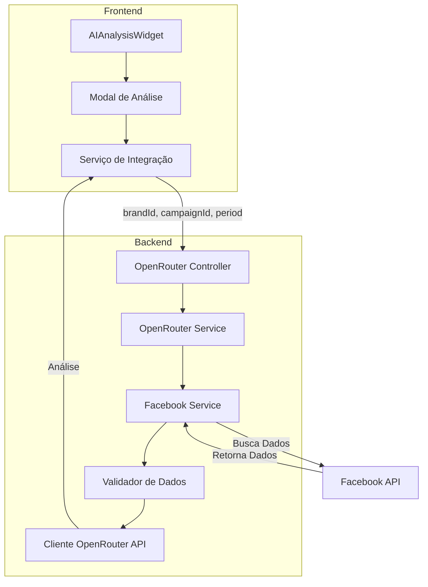

# Plano de Implementação: Análise de Campanhas por IA



## 1. Estrutura do Backend

### 1.1 OpenRouter Module
```typescript
// backend/src/openrouter/openrouter.module.ts
@Module({
  imports: [FacebookModule],
  controllers: [OpenRouterController],
  providers: [OpenRouterService],
  exports: [OpenRouterService]
})
```

### 1.2 Interface de Requisição
```typescript
interface AnalysisRequest {
  brandId: string;
  campaignId: string;
  period: {
    since: string;
    until: string;
  };
}
```

### 1.3 Fluxo de Dados
1. Receber requisição com brandId, campaignId e período
2. Buscar dados da campanha via Facebook API
3. Formatar dados para análise
4. Enviar para OpenRouter API
5. Retornar análise para o frontend

### 1.4 Endpoints
```typescript
POST /api/analysis/campaign
  - Recebe: brandId, campaignId, period
  - Busca dados no Facebook
  - Processa com OpenRouter
  - Retorna análise
```

## 2. Estrutura do Frontend

### 2.1 Componentes
```typescript
// AIAnalysisWidget.tsx
- Botão de análise
- Modal com resultado
- Loading state
- Tratamento de erros

// Serviço de integração
- Método para solicitar análise
- Tratamento de resposta
- Gestão de estado
```

### 2.2 Interface de Requisição
```typescript
interface RequestAnalysis {
  brandId: string;
  campaignId: string;
  period: {
    since: string;
    until: string;
  };
}
```

## 3. Integração OpenRouter

### 3.1 Configuração
```typescript
const config = {
  apiKey: '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',
  model: 'deepseek/deepseek-r1:free',
  baseUrl: 'https://openrouter.ai/api/v1'
}
```

### 3.2 Prompt Template
```typescript
const promptTemplate = `
Analise os seguintes dados de campanha de marketing:

Métricas:
- Impressões: ${metrics.impressions}
- Cliques: ${metrics.clicks}
- Gastos: ${metrics.spend}
- CTR: ${metrics.ctr}%
- CPC: ${metrics.cpc}
- CPM: ${metrics.cpm}

Demografia:
${JSON.stringify(demographics, null, 2)}

Período: ${period.since} até ${period.until}

Por favor, forneça:
1. Uma análise geral do desempenho da campanha
2. Pontos fortes e fracos identificados
3. Recomendações de otimização
4. Insights sobre o público-alvo
5. Sugestões de ações práticas
`;
```

## 4. Fluxo de Implementação

1. Backend:
   - Criar módulo OpenRouter
   - Integrar com Facebook Service existente
   - Implementar serviço de análise
   - Criar endpoints
   - Adicionar validações

2. Frontend:
   - Criar componente AIAnalysisWidget
   - Implementar modal
   - Adicionar serviço de integração
   - Implementar tratamento de estado

## 5. Medidas de Segurança

1. Backend:
   - Validação dos IDs recebidos
   - Rate limiting
   - Autenticação JWT
   - Validação de permissões do usuário para a brand/campaign

2. Frontend:
   - Validação de dados antes do envio
   - Tratamento de erros
   - Loading states
   - Feedback visual para o usuário