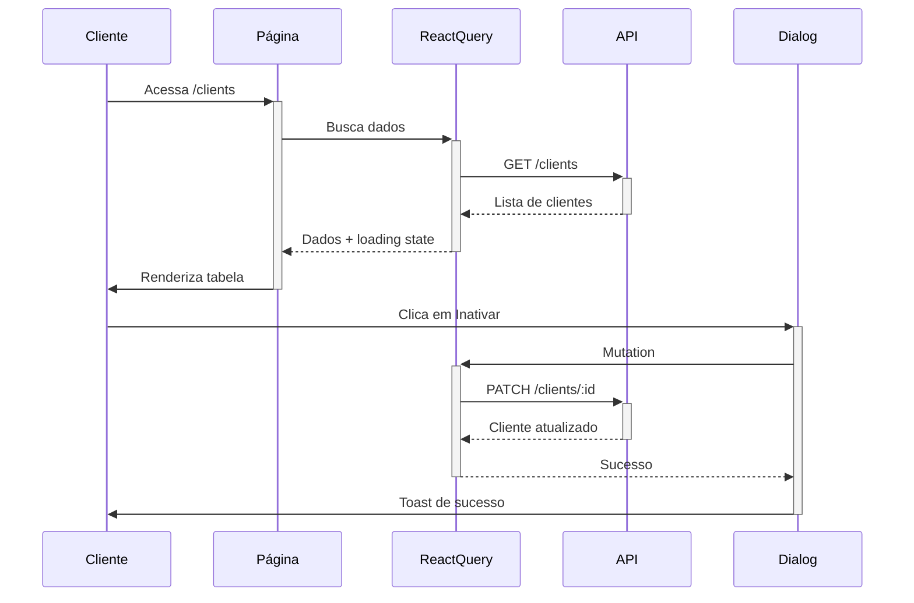

# Plano de Implementação do Módulo de Clientes

## 1. Estrutura de Diretórios
- `/pages/clients/index.tsx` - Página principal de listagem
- `/pages/clients/[id]/edit.tsx` - Página de edição
- `/components/clients/` - Componentes específicos do módulo
- `/services/clients.ts` - Serviços de API

## 2. Componentes Principais

### 2.1 ClientsTable
- Utilizaremos o componente Table do shadcn
- Colunas:
  - Status (com indicador visual)
  - Nome do Responsável
  - Nome da Empresa
  - Email
  - Telefone
  - Valor
  - Ações (editar, inativar)
- Paginação integrada
- Ordenação por colunas

### 2.2 ClientForm
- Formulário de edição utilizando react-hook-form e zod
- Campos:
  - Status (Select)
  - Nome do Responsável (Input)
  - Nome da Empresa (Input)
  - Email (Input)
  - Telefone (Input)
  - Valor (Input numérico)
  - Observações (Textarea)

### 2.3 ClientActions
- Menu de ações por cliente
- Opções:
  - Editar (redirecionamento)
  - Inativar/Ativar (dialog de confirmação)

### 2.4 ClientFilters
- Filtros de pesquisa:
  - Busca por texto (nome, empresa, email)
  - Status (múltipla seleção)
  - Ordenação

## 3. Integrações

### 3.1 API
```typescript
// services/clients.ts
interface ClientsService {
  list(params: FilterClientsDto): Promise<PaginatedResponse<Client>>;
  getById(id: number): Promise<Client>;
  update(id: number, data: UpdateClientDto): Promise<Client>;
  create(data: CreateClientDto): Promise<Client>;
}
```

### 3.2 React Query
- Queries:
  - useClients (listagem com filtros)
  - useClient (detalhes do cliente)
- Mutations:
  - useUpdateClient
  - useCreateClient
  - useUpdateClientStatus

## 4. Bibliotecas Utilizadas
- shadcn/ui para componentes base
- @tanstack/react-query para gerenciamento de estado e cache
- react-hook-form para formulários
- zod para validação
- sonner para notificações
- axios para requisições HTTP

## 5. Fluxo de Dados


## 6. Cronograma Estimado
1. Configuração inicial e estrutura - 2h
2. Implementação da tabela e listagem - 4h
3. Implementação dos filtros - 2h
4. Implementação do formulário de edição - 3h
5. Implementação das ações (inativar/ativar) - 2h
6. Testes e ajustes - 3h

Total estimado: 16 horas

## 7. Próximos Passos
1. Aprovação do plano
2. Criação da estrutura base
3. Implementação dos componentes
4. Testes e revisão
5. Documentação