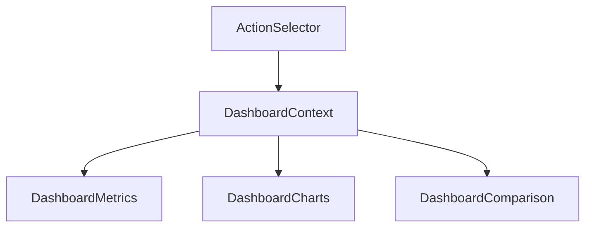

# Dashboard Action Selector Integration

## Overview
Integrate the ActionSelector component into the dashboard to allow users to select which Facebook action metrics they want to display.

## Integration Steps

### 1. Update Dashboard Context
```typescript
// Create a new context for managing selected actions
interface DashboardActionsContext {
  selectedActions: string[];
  setSelectedActions: (actions: string[]) => void;
}

// Add persistent storage
const STORAGE_KEY = 'dashboard-selected-actions';
```

### 2. Add Action Selection State
- Store selected actions in localStorage
- Default to most common metrics
- Sync across page reloads

### 3. Modify Data Flow
1. DashboardPage
   ```tsx
   function DashboardPage() {
     const [selectedActions, setSelectedActions] = useState<string[]>([]);
     // Pass to children components
   }
   ```

2. DashboardMetrics
   ```tsx
   interface DashboardMetricsProps {
     data: FacebookCampaignMetrics[];
     selectedActions: string[];
   }
   ```

3. Filter displayed actions based on selection

### 4. UI Integration Points

1. Add ActionSelector to DashboardHeader:
```tsx
<div className="flex items-center gap-4">
  <DateRangePicker />
  <ActionSelector 
    selectedActions={selectedActions}
    onSelectionChange={setSelectedActions}
  />
</div>
```

2. Update DashboardMetrics display:
```tsx
// Filter metrics based on selected actions
const filteredMetrics = useMemo(() => 
  metrics.filter(metric => selectedActions.includes(metric.type))
, [metrics, selectedActions]);
```

### 5. Data Flow


## UI Location Options

### Option 1: Header Integration
```
┌─ Dashboard Header ──────────────────────────────┐
│                                                │
│  [Date Range] [Action Selector] [Other Filters]│
│                                                │
└────────────────────────────────────────────────┘
```

### Option 2: Metrics Section
```
┌─ Metrics Section ─────────────────────────────┐
│                                              │
│  Metrics Overview         [Select Actions ▼]  │
│                                              │
└──────────────────────────────────────────────┘
```

### Option 3: Sidebar Integration
```
┌─ Sidebar ──────┐
│               │
│  Navigation   │
│               │
│  Filters      │
│               │
│  [Actions]    │
│               │
└───────────────┘
```

## Implementation Priority

1. Core Integration
   - Add context provider
   - Implement storage
   - Basic UI integration

2. UX Improvements
   - Loading states
   - Error handling
   - Selection persistence

3. Performance
   - Memoization
   - Lazy loading
   - Data caching

## Success Metrics

1. Performance
   - < 100ms filter time
   - No UI jank
   - Smooth animations

2. Usability
   - Clear selection state
   - Intuitive location
   - Persistent preferences

## Next Steps

1. Choose integration location
2. Implement context provider
3. Add storage layer
4. Integrate UI components
5. Test performance
6. Add documentation