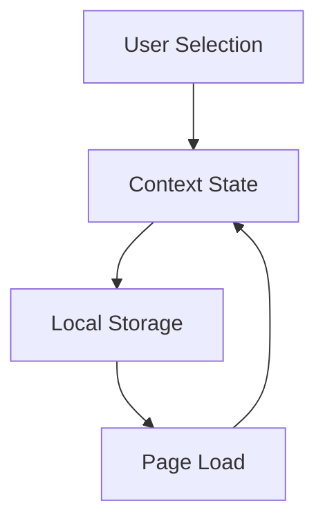

# Dashboard Context Implementation

## Overview
Implement a context system to manage dashboard state, including selected actions and their persistence.

## Context Structure

### 1. DashboardActionsContext
```typescript
interface DashboardState {
  selectedActions: string[];
  expandedCategories: string[];
  defaultActions: string[];
  lastUpdated: string;
}

interface DashboardActionsContext {
  // State
  selectedActions: string[];
  isActionSelected: (actionId: string) => boolean;
  
  // Actions
  selectActions: (actions: string[]) => void;
  toggleAction: (actionId: string) => void;
  resetToDefault: () => void;
  
  // Categories
  expandedCategories: string[];
  toggleCategory: (categoryId: string) => void;
  
  // Loading states
  isLoading: boolean;
  error: Error | null;
}
```

## Implementation

### 1. Provider Component
```typescript
export function DashboardProvider({ children }: { children: React.ReactNode }) {
  // State management
  const [state, setState] = useState<DashboardState>(() => loadFromStorage());
  
  // Action handlers
  const contextValue = useMemo(() => ({
    selectedActions: state.selectedActions,
    isActionSelected: (id: string) => state.selectedActions.includes(id),
    selectActions: (actions: string[]) => {
      setState(prev => ({
        ...prev,
        selectedActions: actions,
        lastUpdated: new Date().toISOString()
      }));
    },
    // ... other handlers
  }), [state]);

  return (
    <DashboardContext.Provider value={contextValue}>
      {children}
    </DashboardContext.Provider>
  );
}
```

### 2. Storage Integration
```typescript
const STORAGE_KEY = 'dashboard-state';

function loadFromStorage(): DashboardState {
  try {
    const stored = localStorage.getItem(STORAGE_KEY);
    if (stored) {
      return JSON.parse(stored);
    }
  } catch (error) {
    console.error('Failed to load dashboard state:', error);
  }

  return {
    selectedActions: DEFAULT_ACTIONS,
    expandedCategories: [],
    defaultActions: DEFAULT_ACTIONS,
    lastUpdated: new Date().toISOString()
  };
}

function saveToStorage(state: DashboardState) {
  try {
    localStorage.setItem(STORAGE_KEY, JSON.stringify(state));
  } catch (error) {
    console.error('Failed to save dashboard state:', error);
  }
}
```

### 3. Custom Hook
```typescript
export function useDashboardActions() {
  const context = useContext(DashboardContext);
  
  if (!context) {
    throw new Error('useDashboardActions must be used within DashboardProvider');
  }
  
  return context;
}
```

## Integration Points

### 1. Dashboard Layout
```typescript
export function DashboardLayout({ children }: { children: React.ReactNode }) {
  return (
    <DashboardProvider>
      <Header />
      <main>{children}</main>
    </DashboardProvider>
  );
}
```

### 2. Metrics Component
```typescript
export function DashboardMetrics() {
  const { selectedActions, isActionSelected } = useDashboardActions();
  
  // Filter metrics based on selection
  const filteredMetrics = useMemo(() => 
    metrics.filter(metric => isActionSelected(metric.type))
  , [metrics, isActionSelected]);

  return (
    <div>
      {/* Render filtered metrics */}
    </div>
  );
}
```

### 3. Action Selector Integration
```typescript
export function DashboardHeader() {
  const { selectedActions, selectActions } = useDashboardActions();

  return (
    <header>
      <ActionSelector
        selectedActions={selectedActions}
        onSelectionChange={selectActions}
      />
    </header>
  );
}
```

## State Persistence Flow


## Error Handling

### 1. Storage Errors
```typescript
function handleStorageError(error: Error) {
  console.error('Storage error:', error);
  // Fallback to memory-only state
  return {
    selectedActions: DEFAULT_ACTIONS,
    expandedCategories: [],
    defaultActions: DEFAULT_ACTIONS,
    lastUpdated: new Date().toISOString()
  };
}
```

### 2. State Validation
```typescript
function validateState(state: unknown): DashboardState {
  // Implement validation logic
  // Return default state if invalid
}
```

## Performance Considerations

1. Memoization
   - Context value
   - Filtered metrics
   - Selection checks

2. Storage Optimization
   - Debounced saves
   - Compressed format
   - Cleanup old data

3. Render Optimization
   - Selective updates
   - Proper dependencies
   - Component splitting

## Migration Strategy

1. Implement alongside existing state
2. Gradually migrate components
3. Remove old implementation
4. Clean up deprecated code