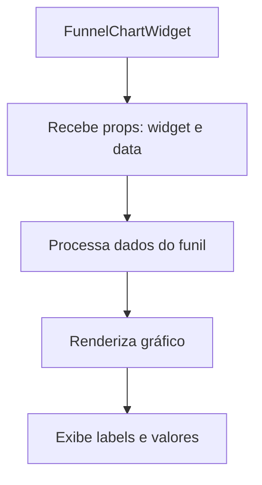

# Plano de Implementação do Gráfico de Funil

## Situação Atual
1. Temos um template de widget do tipo "funnel" já definido no ReportsSidebar
2. A configuração do funil já inclui `funnelMetrics` para as 3 métricas que serão exibidas
3. A chamada API já está sendo feita e os dados estão disponíveis no estado `insightsData`
4. O componente do funil ainda não foi implementado

## Estrutura do Plano

### 1. Criar o Componente FunnelChartWidget

### 2. Implementação
1. Criar arquivo `FunnelChartWidget.tsx` em `front/src/components/ReportsCanvas/`
2. Usar biblioteca ApexCharts que já está instalada
3. Implementar:
   - Processamento dos dados para formato de funil
   - Configuração do gráfico
   - Renderização dos dados com labels e valores
   - Formatação dos valores conforme o tipo de métrica

### 3. Configuração do Widget
1. Adicionar suporte no `WidgetCard` para o tipo "funnel"
2. Permitir configuração das 3 métricas do funil no diálogo de configuração
3. Usar as funções de formatação existentes para cada tipo de métrica

### 4. Integração
1. Atualizar o ReportsCanvas para incluir o novo componente
2. Garantir que os dados sejam passados corretamente
3. Manter consistência com outros widgets em termos de estilo e comportamento

## Decisões Técnicas

1. **Biblioteca de Gráfico**: Usar ApexCharts que já está instalada e tem bom suporte para gráficos de funil
2. **Formatação de Dados**: Usar as funções de formatação existentes em `/lib/format`
3. **Layout**: Seguir o padrão de tamanho 2x2 como outros gráficos
4. **Estilização**: Manter consistência com a paleta de cores atual (COLORS array)

## Considerações de UX

1. Permitir que o usuário selecione as 3 métricas do funil na ordem desejada
2. Mostrar porcentagens de conversão entre cada etapa
3. Exibir valores absolutos junto com as porcentagens
4. Manter consistência visual com outros widgets

## Próximos Passos

1. Criar o componente base do FunnelChartWidget
2. Implementar a lógica de processamento dos dados
3. Adicionar configurações no diálogo de edição
4. Integrar com o ReportsCanvas
5. Testar com diferentes combinações de métricas