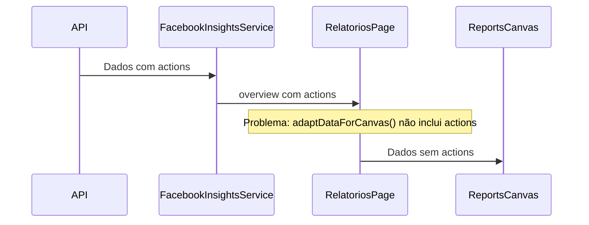

# Plano de Integração de Actions nos Relatórios

## Problema Identificado
O widget de visão geral não está exibindo as métricas de actions porque os dados não estão sendo corretamente passados do FacebookInsightsService para o ReportsCanvas.

## Fluxo Atual


## Análise Técnica
1. O FacebookInsightsService já está recebendo corretamente as actions do backend
   - Interface BaseInsight inclui `actions: Action[]`
   - Actions são retornadas pelo endpoint /facebook/insights/{brandId}/overview

2. O problema está na função adaptDataForCanvas() em relatorios/page.tsx:
   - Recebe os dados do overview incluindo actions
   - Não está incluindo as actions no objeto Account retornado
   - ReportsCanvas não recebe os dados de actions para exibir

## Plano de Correção
1. Modificar a função adaptDataForCanvas() para incluir as actions:
   ```typescript
   const account: Account = {
       ...
       actions: overview?.actions || [],
       ...
   };
   ```

2. Verificar se o ReportsCanvas está recebendo e processando corretamente os dados de actions:
   - Confirmar que a agregação de métricas inclui as actions
   - Garantir que o layout está exibindo os valores corretamente

## Próximos Passos
1. Implementar a correção na função adaptDataForCanvas()
2. Testar a exibição das métricas no widget de visão geral
3. Validar a formatação dos números
4. Verificar se todas as actions estão sendo exibidas corretamente

## Impacto da Mudança
- Melhoria na visualização dos dados
- Exibição correta das métricas de actions
- Sem alterações na estrutura do banco de dados
- Sem alterações na API