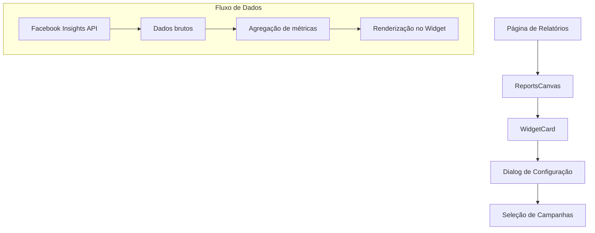
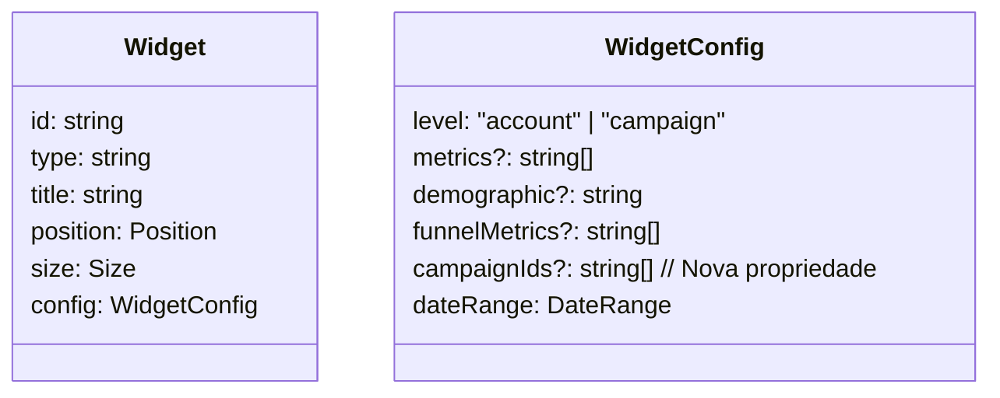
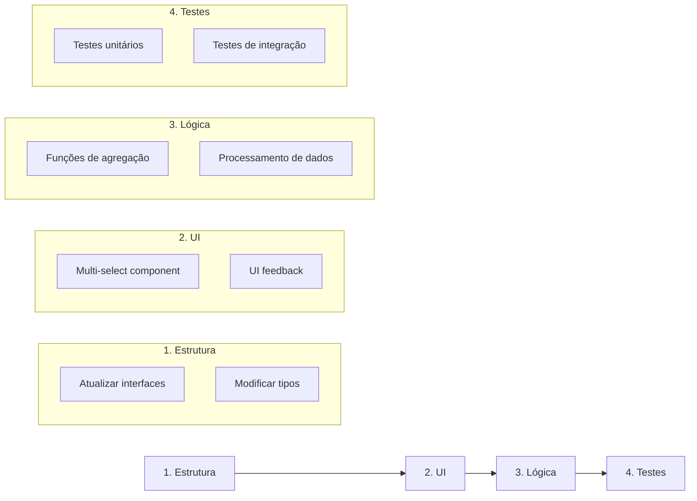

# Plano de Implementação: Seleção Múltipla de Campanhas nos Widgets

## Visão Geral do Fluxo de Dados

## 1. Modificações na Interface de Widget

## 2. Alterações Necessárias

### a) Estrutura de Dados
- Modificar a interface `Widget` para suportar múltiplas campanhas
- Alterar `campaignId` para `campaignIds` como array de strings
- Atualizar as funções de agregação para processar múltiplas campanhas

### b) Componentes UI
- Atualizar o componente de seleção de campanha para permitir múltipla seleção
- Implementar um componente de multi-select com checkboxes
- Adicionar indicadores visuais das campanhas selecionadas

### c) Lógica de Agregação
- Modificar a função `aggregateOverviewMetrics` para somar métricas de múltiplas campanhas
- Atualizar a função `aggregateDailyMetrics` para combinar dados diários de múltiplas campanhas
- Implementar validação para garantir soma correta de métricas

## 3. Etapas de Implementação

## 4. Detalhes da Implementação

### a) Alterações no ReportsCanvas
- Atualizar a lógica de filtragem para considerar múltiplas campanhas
- Modificar a agregação de métricas para somar dados de todas as campanhas selecionadas
- Implementar validações para evitar duplicação de dados

### b) Modificações no WidgetCard
- Atualizar o componente de configuração para suportar seleção múltipla
- Implementar UI para mostrar campanhas selecionadas
- Adicionar validações para seleção de campanhas

### c) Atualizações no Serviço de Dados
- Modificar funções de processamento para lidar com múltiplas campanhas
- Implementar novas funções de agregação quando necessário
- Atualizar a lógica de cálculo de métricas

## 5. Considerações Importantes
- Manter a performance ao agregar dados de múltiplas campanhas
- Garantir que as métricas calculadas (CTR, CPC, etc.) sejam precisas
- Implementar feedback visual claro sobre quais campanhas estão selecionadas
- Adicionar validações para prevenir erros de dados