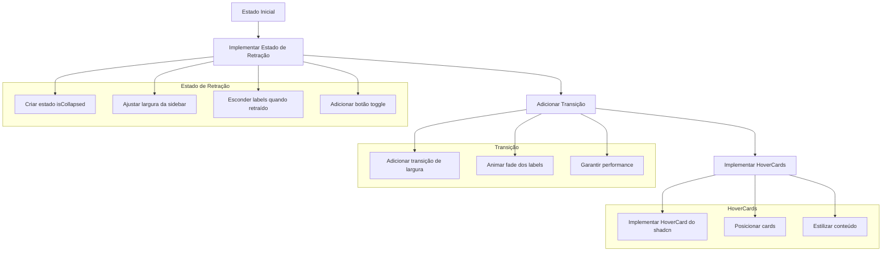

# Implementação da Sidebar Retrátil

## Visão Geral
Implementar uma sidebar retrátil que mostra apenas ícones quando retraída e exibe cards de hover com os nomes das seções ao passar o mouse.



## Etapas de Implementação

### 1. Configuração Inicial
```bash
npx shadcn-ui add hover-card
```

### 2. Modificações na Sidebar

#### Estado de Retração
- Adicionar estado `isCollapsed` usando `useState`
- Persistir estado no localStorage para manter a preferência do usuário
- Implementar botão para alternar retração

#### Classes CSS
```tsx
// Largura dinâmica
<aside className={cn(
  "border-r bg-background min-h-screen transition-all duration-300",
  isCollapsed ? "w-[80px]" : "w-[280px]"
)}>
```

#### Botão Toggle
```tsx
<Button
  variant="ghost"
  size="icon"
  onClick={() => setIsCollapsed(!isCollapsed)}
  className="absolute right-2 top-3"
>
  <ChevronLeft className={cn(
    "h-4 w-4 transition-transform",
    isCollapsed && "rotate-180"
  )} />
</Button>
```

### 3. Implementação dos HoverCards

#### Estrutura do Item de Menu
```tsx
<HoverCard openDelay={200} closeDelay={100}>
  <HoverCardTrigger asChild>
    <Link href={item.href} className="block">
      <Button
        variant={isActive ? "secondary" : "ghost"}
        className={cn(
          "w-full transition-all",
          isCollapsed ? "justify-center" : "justify-start gap-3",
          isActive && "bg-primary/10 text-primary hover:bg-primary/20"
        )}
      >
        <item.icon className="h-5 w-5" />
        {!isCollapsed && item.label}
      </Button>
    </Link>
  </HoverCardTrigger>
  {isCollapsed && (
    <HoverCardContent 
      side="right" 
      align="start" 
      className="w-40 p-2"
    >
      {item.label}
    </HoverCardContent>
  )}
</HoverCard>
```

### 4. Melhorias de UX

#### Animações
- Usar Tailwind para transições suaves:
  - `transition-all`
  - `duration-300`
  - `ease-in-out`
- Adicionar delay no HoverCard para evitar triggers acidentais
- Fade suave do conteúdo do HoverCard

#### Performance
- Usar `useCallback` para handlers
- Implementar `useMemo` para cálculos de estilo
- Garantir que transições sejam otimizadas

#### Acessibilidade
- Manter foco adequado ao navegar
- Adicionar atributos ARIA apropriados
- Garantir navegação por teclado
- Manter funcionalidade mesmo sem hover (mobile/touch)

## Vantagens do HoverCard
1. Experiência mais suave e intuitiva
2. Melhor para casos de apenas visualização (não precisa clicar)
3. Controle preciso sobre delays de abertura/fechamento
4. Animações fluidas por padrão
5. Melhor suporte a acessibilidade

## Tempo Estimado
2-3 horas de implementação

## Próximos Passos
1. Implementar estado base e estrutura
2. Adicionar comportamento de retração
3. Implementar HoverCards
4. Refinar animações e UX
5. Testes e ajustes finais

## Considerações Técnicas
- O HoverCard será mostrado apenas quando a sidebar estiver retraída
- Delays de open/close ajustados para evitar flickering
- Layout responsivo mantido com ou sem JavaScript
- Persistência do estado no localStorage